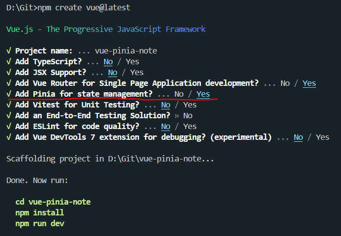
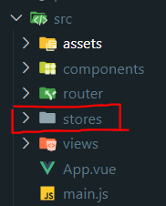
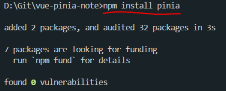
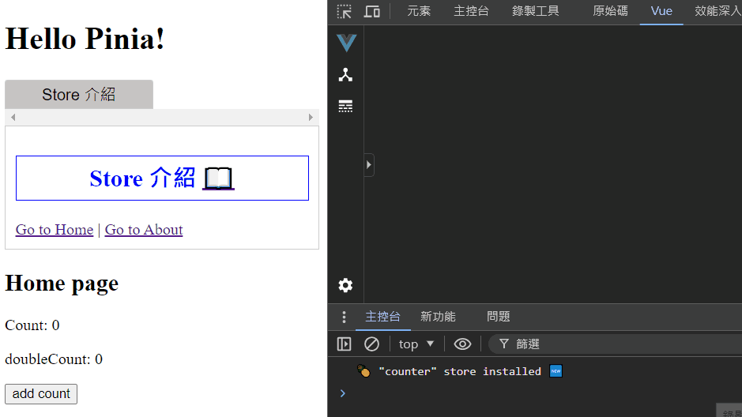
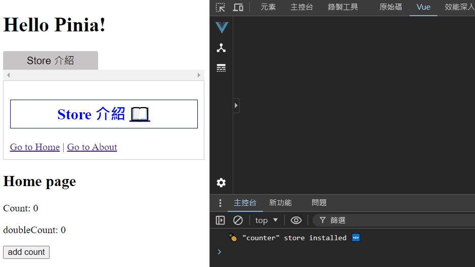
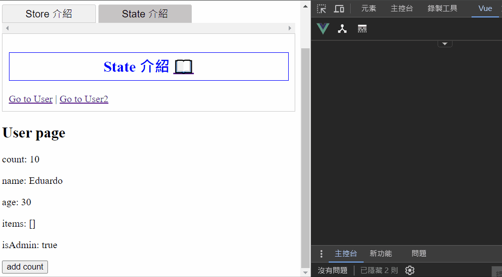
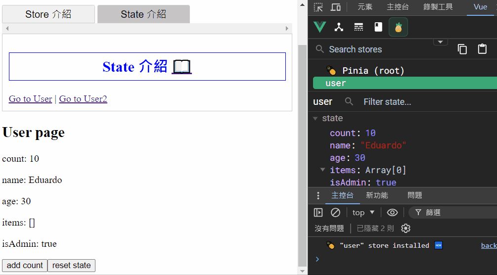
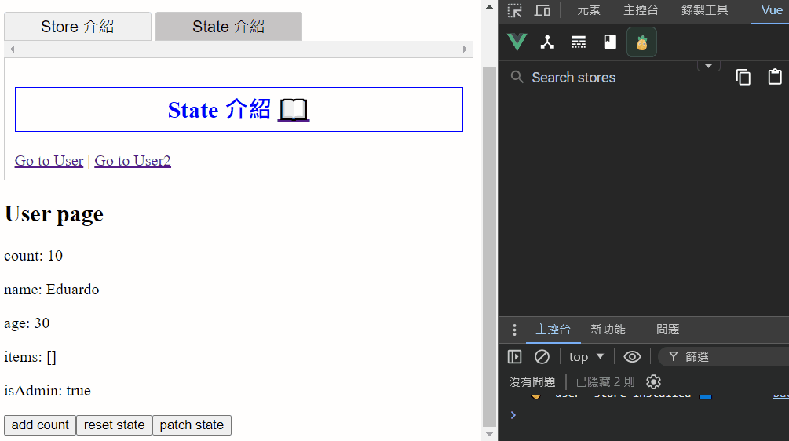
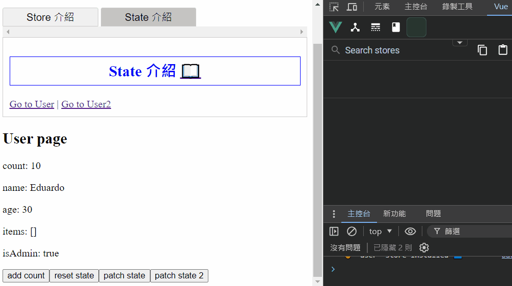
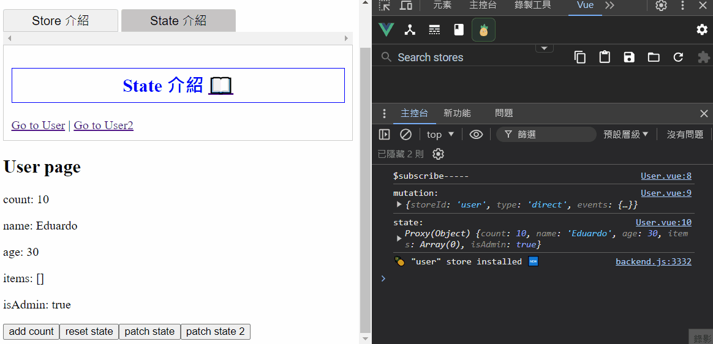

# Pinia 狀態管理庫 學習筆記

主要根據 Pinia 官方文檔整理的學習筆記，方便查閱。

## 官方文檔

> https://pinia.vuejs.org <br> https://pinia.vuejs.org/zh

## 目錄

- [簡介](#簡介)

- [安裝 Pinia](#安裝-pinia)

- [基礎配置](#基礎配置)

- [Store 介紹](#store-介紹)

  - [使用時機](#使用時機)

  - [定義 Store](#定義-store)

  - [使用 Store](#使用-store)

  - [從 Store 解構](#從-store-解構)

- [State 介紹](#state-介紹)

  - [定義 State](#定義-state)

  - [訪問 State](#訪問-state)

  - [重置 State](#重置-state)

  - [變更 State](#變更-state)

  - [訂閱 State 變化](#訂閱-state-變化)

## 簡介

Pinia 為 Vue 的專屬狀態管理庫，**允許跨組件或頁面共享狀態**，並且支持 Vue 2 和 Vue 3。

以下筆記使用 Vue 3 搭配 Vue Router 4 來說明，Vue 2 相關部分請參考[官方文檔](#官方文檔)。

補充筆記：

- [Vue 3 學習筆記](https://github.com/YPINPIN/vue3-note?tab=readme-ov-file#vue-3-%E5%AD%B8%E7%BF%92%E7%AD%86%E8%A8%98)

- [Vue Router 4 學習筆記](https://github.com/YPINPIN/vue-router4-note?tab=readme-ov-file#vue-router-4-%E5%AD%B8%E7%BF%92%E7%AD%86%E8%A8%98)

## 安裝 Pinia

### 1. 基於 Vite 創建新專案

在環境安裝時選擇添加使用 Pinia 即可。

```bash
npm create vue@latest
```



Pinia 相關文件夾：



### 2. 現有專案新增安裝

安裝完成後需要自己配置相關文件，參考下面的[基礎配置](#基礎配置)。

```bash
npm install pinia
```



## 基礎配置

### 1. main.js 創建 pinia 實例並使用

```javascript
import { createApp } from 'vue';
import App from './App.vue';
import router from './router';

// 創建 pinia 實例
import { createPinia } from 'pinia';
const pinia = createPinia();

const app = createApp(App);

app.use(router);
// 使用 pinia
app.use(pinia);

app.mount('#app');
```

### 2. 新增 Pinia 相關文件夾 stores

在 src 下建立 stores 資料夾，通常定義的 Store 文件會放置在此。


## Store 介紹

**Store 是一個保存狀態和邏輯的實體**，有點像一個永遠存在的組件，每個組件都可以讀取和寫入它，可以根據需求創建多個 Store 來儲存不同的數據狀態。

它有三個概念：state、getters、actions，可以假設這些概念相當於組件中的 data、computed、methods。

### 使用時機

一個 Store 應該包含可以在整個應用中訪問的數據，像是需要在許多地方使用的數據 (使用者訊息、多步驟表單等等) ，而應該避免在 Store 中引入可以在組件中保存的本地數據。

### 定義 Store

在 stores 資料夾下新增一個 js 檔案，使用 `defineStore()` 定義 Store 並 export。

**第一個參數要求是一個獨一無二的名字**，這個名字也被用作 id，是必須傳入的，Pinia 將用它來連接 store 和 devtools。

`defineStore()` 的**第二個參數可以接受 Setup 函數或 Option 物件**，以下會分別介紹兩種類型。

> 習慣上通常會將 `defineStore()` 返回的函數以 `use` 為開頭命名。

- Option Store

  與 Vue 的選項式 API 類似，可以傳入一個帶有 `state`、`actions` 與 `getters` 屬性的 Option 物件。

  - state => store 的數據(data)

  - getters => store 的計算屬性(computed)

  - actions => store 的方法(methods)

  ```javascript
  // counter.js
  import { defineStore } from 'pinia';

  export const useCounterStore = defineStore('counter', {
    state: () => {
      return {
        count: 0,
      };
    },
    getters: {
      doubleCount: (state) => state.count * 2,
    },
    actions: {
      increment() {
        this.count++;
      },
    },
  });
  ```

- Setup Store

  與 Vue 的組合式 API 的 `setup` 函數相似，可以傳入一個函數，**該函數定義了一些響應式屬性和方法，並且返回一個帶有要使用的屬性及方法的物件**。

  - ref() => state 屬性

  - computed() => getters

  - function() => actions

  ```javascript
  // counter2.js
  import { defineStore } from 'pinia';
  import { computed, ref } from 'vue';

  export const useCounter2Store = defineStore('counter2', () => {
    // 定義響應式屬性和方法，
    const count = ref(0);
    const doubleCount = computed(() => count.value * 2);
    function increment() {
      count.value++;
    }

    // 返回要使用的屬性及方法的物件
    return {
      count,
      doubleCount,
      increment,
    };
  });
  ```

  > 需要注意：要讓 pinia 正確識別 state，必須在 setup store 中返回 state 的所有屬性，代表你不能在 store 中使用私有屬性。不完整返回會影響 SSR、開發工具和其他插件的正常運行。

### 使用 Store

在要使用 Store 的組件的 `<script setup>` 中引入並調用 `defineStore()` 返回的函數之後會創建 Store 實例，接著可以在組件中的任意位置訪問 Store 中的 `state`、`getters`、`actions` 中定義的任何屬性。

> 需要注意： Store 是一個用 `reactive` 包裝的物件，因此不需要使用 `.value`，**並且不能直接對它進行解構 (會破壞響應性)**，需要解構請參考以下的[從 Store 解構](#從-store-解構)。

Home.vue：

```vue
<script setup>
// 引入 Store
import { useCounterStore } from '@/stores/counter';

// 調用函數，現在可以在組件中使用 store
const store = useCounterStore();

// 可以直接調用 actions
setTimeout(() => {
  store.increment();
}, 1000);
</script>

<template>
  <h2>Home page</h2>
  <p>Count: {{ store.count }}</p>
  <p>doubleCount: {{ store.doubleCount }}</p>
  <div>
    <button @click="store.increment()">add count</button>
  </div>
</template>
```



### 從 Store 解構

**為了在解構時保持屬性的響應性，則需要使用 `storeToRefs()`**，它會為每一個響應式屬性創建 `ref` 引用，並且會跳過所有的 actions 或非響應式的屬性。

About.vue：

```vue
<script setup>
// 引入 Store
import { useCounterStore } from '@/stores/counter';
import { storeToRefs } from 'pinia';

// 調用函數，現在可以在組件中使用 store
const store = useCounterStore();

// 使用 storeToRefs 解構
const { count, doubleCount } = storeToRefs(store);
// 作為 actions 的 increment 可以直接解構
const { increment } = store;
</script>

<template>
  <h2>About page</h2>
  <p>Count: {{ count }}</p>
  <p>doubleCount: {{ doubleCount }}</p>
  <div>
    <button @click="increment()">add count</button>
  </div>
</template>
```



## State 介紹

`state` 為 Store 的核心。在 Pinia 中，`state` 被定義為一個返回初始狀態 (object) 的函數，這使 Pinia 可以同時支援伺服器端和用戶端。

### 定義 State

- Option Store

  ```javascript
  // user.js
  import { defineStore } from 'pinia';

  export const useUserStore = defineStore('user', {
    state: () => {
      return {
        // 所有屬性將會自動推斷出它們的類型
        count: 0,
        name: 'Eduardo',
        age: 30,
        items: [],
        isAdmin: true,
      };
    },
  });
  ```

- Setup Store

  ```javascript
  // user2.js
  import { defineStore } from 'pinia';
  import { ref } from 'vue';

  export const useUser2Store = defineStore('user2', () => {
    const count = ref(10);
    const name = ref('Peter');
    const age = ref(25);
    const items = ref([]);
    const isAdmin = ref(false);

    return { count, name, age, items, isAdmin };
  });
  ```

### 訪問 State

默認情況下，可以通過 Store 實例訪問 `state`，**可以不用透過呼叫函數的方式，直接對其狀態進行讀寫**。

User.vue：

```vue
<script setup>
import { useUserStore } from '@/stores/user';

const user = useUserStore();
user.count += 10;
</script>

<template>
  <h2>User page</h2>
  <p>count: {{ user.count }}</p>
  <p>name: {{ user.name }}</p>
  <p>age: {{ user.age }}</p>
  <p>items: {{ user.items }}</p>
  <p>isAdmin: {{ user.isAdmin }}</p>
  <div>
    <button @click="user.count++">add count</button>
  </div>
</template>
```

User2.vue：

```vue
<script setup>
import { useUser2Store } from '@/stores/user2';

const user2 = useUser2Store();
user2.count += 10;
</script>

<template>
  <h2>User2 page</h2>
  <p>count: {{ user2.count }}</p>
  <p>name: {{ user2.name }}</p>
  <p>age: {{ user2.age }}</p>
  <p>items: {{ user2.items }}</p>
  <p>isAdmin: {{ user2.isAdmin }}</p>
  <div>
    <button @click="user2.count++">add count</button>
  </div>
</template>
```



### 重置 State

使用 Option Store 定義 State 時，可以通過調用 store 的 `$reset()` 方法將 `state` 重置為初始值。`$reset()` 內部會調用 `state()` 函數來**創建一個新的狀態物件，並用它替換當前狀態**。

User.vue：

```vue
<script setup>
import { useUserStore } from '@/stores/user';

const user = useUserStore();
user.count += 10;
</script>

<template>
  <h2>User page</h2>
  <!-- 省略 -->
  <div>
    <button @click="user.count++">add count</button>
    <button @click="user.$reset()">reset state</button>
  </div>
</template>
```



使用 Setup Store 時，**則需要創建自己的 `$reset()` 方法**。

修改 user2.js 創建自己的 `$reset()` 方法：

```javascript
// user2.js
import { defineStore } from 'pinia';
import { ref } from 'vue';

export const useUser2Store = defineStore('user2', () => {
  const count = ref(10);
  const name = ref('Peter');
  const age = ref(25);
  const items = ref([]);
  const isAdmin = ref(false);

  // $reset()
  function $reset() {
    count.value = 10;
    name.value = 'Peter';
    age.value = 25;
    items.value = [];
    isAdmin.value = false;
  }

  return { count, name, age, items, isAdmin, $reset };
});
```

User2.vue：

```vue
<script setup>
import { useUser2Store } from '@/stores/user2';

const user2 = useUser2Store();
user2.count += 10;
</script>

<template>
  <h2>User2 page</h2>
  <!-- 省略 -->
  <div>
    <button @click="user2.count++">add count</button>
    <button @click="user2.$reset()">reset state</button>
  </div>
</template>
```


### 變更 State

除了使用前面介紹的直接對 `state` 進行修改，還可以調用 `$patch` 方法，**它允許用一個 `state` 物件同時更改多個屬性**。

User.vue：

```vue
<script setup>
import { useUserStore } from '@/stores/user';

const user = useUserStore();
user.count += 10;

function patchState() {
  user.$patch({
    count: 50,
    name: 'Eduardo~~~',
    age: 35,
  });
}
</script>

<template>
  <h2>User page</h2>
  <!-- 省略 -->
  <div>
    <button @click="user.count++">add count</button>
    <button @click="user.$reset()">reset state</button>
    <button @click="patchState">patch state</button>
  </div>
</template>
```



但是 `$patch` 這種方法對於集合的修改 (陣列的添加、移除元素等等) 可能會比較麻煩，每次都要創建一個新的集合，**因此 `$patch` 方法也接受一個函數來組合這種較複雜的變更**。

User.vue：

```vue
<script setup>
import { useUserStore } from '@/stores/user';

const user = useUserStore();
user.count += 10;

function patchState() {
  // 省略...
}
function patchState2() {
  user.$patch((state) => {
    state.count += 2;
    state.items.push({ name: 'shoes', quantity: 1 });
  });
}
</script>

<template>
  <h2>User page</h2>
  <!-- 省略 -->
  <div>
    <!-- 省略 -->
    <button @click="patchState2">patch state 2</button>
  </div>
</template>
```



### 訂閱 State 變化

可以通過 store 的 `$subscribe()` 方法監聽 `state` 及其變化。

`$subscribe()` 方法傳入一個函數，此函數會包含 `mutation`、`state` 兩個參數。

`mutation` 主要包含以下屬性值：

- events

  當前 `state` 改變的具體數據，包括改變前的值和改變後的值等等數據。

- storeId

  當前 store 的 id。

- type

  用於紀錄這次數據變化是通過甚麼途徑，主要有以下三種：

  - direct => 通過 `actions` 或是直接修改 `state` 狀態。

  - patch object => 通過 `$patch` 傳遞物件的方式。

  - patch function => 通過 `$patch` 傳遞函數的方式。

- payload

  只有 `type === 'patch object'` 的情況下才可用，為傳遞給 `$patch` 的物件。

User.vue：

```vue
<script setup>
import { useUserStore } from '@/stores/user';

const user = useUserStore();

// 監聽 State 變化
user.$subscribe((mutation, state) => {
  console.log('$subscribe-----');
  console.log('mutation: ', mutation);
  console.log('state: ', state);
});

user.count += 10;

function patchState() {
  // 省略...
}
function patchState2() {
  // 省略...
}
</script>

<template>
  <h2>User page</h2>
  <!-- 省略 -->
</template>
```



默認情況下，`state subscription` 會被綁定到添加它們的組件上，因此當組件被卸載 (unmount) 時它會被自動刪除。若想在卸載後依舊保留，則需要傳遞第二個參數 `{ detached: true }`，`state subscription` 會從當前組件中分離。

```vue
<script setup>
const someStore = useSomeStore();
// 此訂閱器在組件卸載後依舊會被保留
const unsubscribe = someStore.$subscribe(callback, { detached: true });
// 在合適的時候調用它，則可以取消這個訂閱
unsubscribe();
</script>
```
