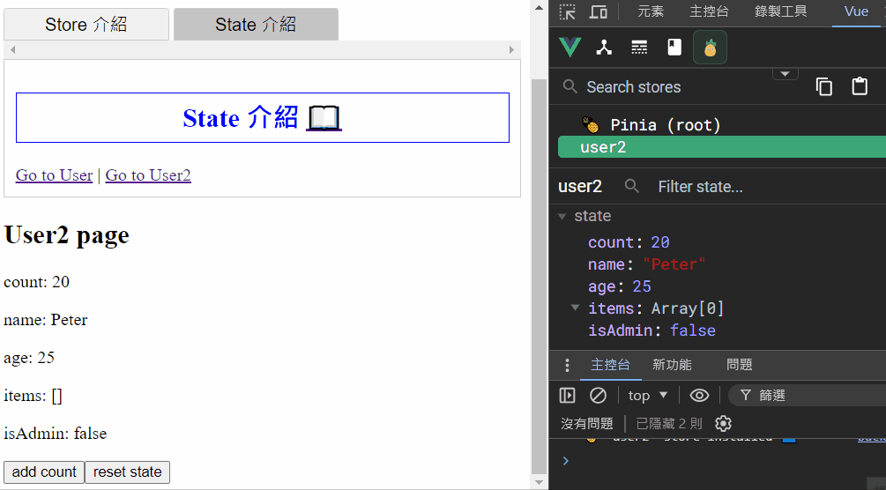
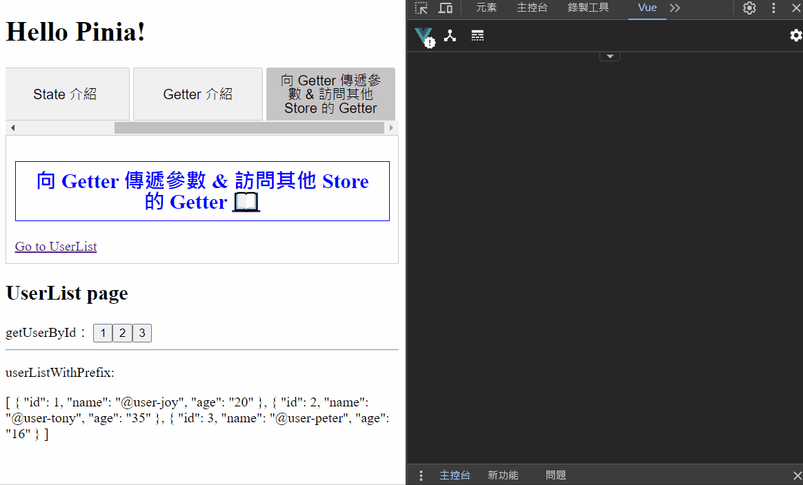
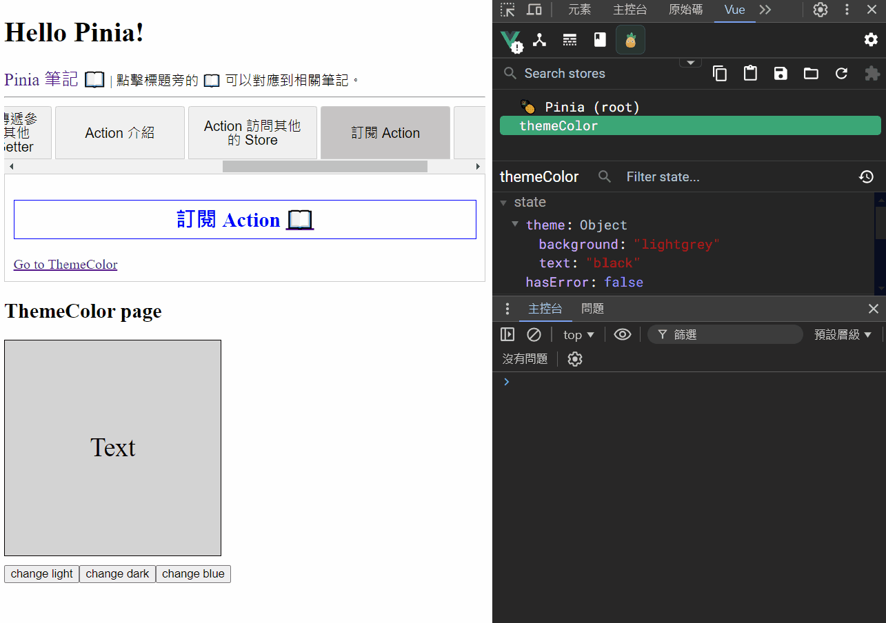

# Pinia 狀態管理庫 學習筆記

主要根據 Pinia 官方文檔整理的學習筆記，方便查閱。

## 官方文檔

> https://pinia.vuejs.org <br> https://pinia.vuejs.org/zh

## 目錄

- [簡介](#簡介)

- [安裝 Pinia](#安裝-pinia)

- [基礎配置](#基礎配置)

- [Store 介紹](#store-介紹)

  - [使用時機](#使用時機)

  - [定義 Store](#定義-store)

  - [使用 Store](#使用-store)

  - [從 Store 解構](#從-store-解構)

- [State 介紹](#state-介紹)

  - [定義 State](#定義-state)

  - [訪問 State](#訪問-state)

  - [重置 State](#重置-state)

  - [變更 State](#變更-state)

  - [訂閱 State 變化](#訂閱-state-變化)

- [Getter 介紹](#getter-介紹)

  - [定義 Getter](#定義-getter)

  - [使用 Getter](#使用-getter)

  - [訪問其他 Getter](#訪問其他-getter)

  - [向 Getter 傳遞參數](#向-getter-傳遞參數)

  - [訪問其他 Store 的 Getter](#訪問其他-store-的-getter)

- [Action 介紹](#action-介紹)

  - [定義 Action](#定義-action)

  - [調用 Action](#調用-action)

  - [Action 訪問其他的 Store](#action-訪問其他的-store)

  - [訂閱 Action](#訂閱-action)

- [Plugin](#plugin)

  - [Plugin 簡介](#plugin-簡介)

  - [擴展 Store](#擴展-store)

    - [添加新的 State](#添加新的-state)

    - [重置 Plugin 新添加的 State](#重置-plugin-新添加的-state)

  - [加新的外部屬性](#添加新的外部屬性)

  - [在 Plugin 中調用 $subscribe](#在-plugin-中調用-subscribe)

  - [添加新的選項 (options)](#添加新的選項-options)

## 簡介

Pinia 為 Vue 的專屬狀態管理庫，**允許跨組件或頁面共享狀態**，並且支持 Vue 2 和 Vue 3。

以下筆記使用 Vue 3 搭配 Vue Router 4 來說明，Vue 2 相關部分請參考[官方文檔](#官方文檔)。

補充筆記：

- [Vue 3 學習筆記](https://github.com/YPINPIN/vue3-note?tab=readme-ov-file#vue-3-%E5%AD%B8%E7%BF%92%E7%AD%86%E8%A8%98)

- [Vue Router 4 學習筆記](https://github.com/YPINPIN/vue-router4-note?tab=readme-ov-file#vue-router-4-%E5%AD%B8%E7%BF%92%E7%AD%86%E8%A8%98)

## 安裝 Pinia

### 1. 基於 Vite 創建新專案

在環境安裝時選擇添加使用 Pinia 即可。

```bash
npm create vue@latest
```


Pinia 相關文件夾：


### 2. 現有專案新增安裝

安裝完成後需要自己配置相關文件，參考下面的[基礎配置](#基礎配置)。

```bash
npm install pinia
```


## 基礎配置

### 1. main.js 創建 pinia 實例並使用

```javascript
import { createApp } from 'vue';
import App from './App.vue';
import router from './router';

// 創建 pinia 實例
import { createPinia } from 'pinia';
const pinia = createPinia();

const app = createApp(App);

app.use(router);
// 使用 pinia
app.use(pinia);

app.mount('#app');
```

### 2. 新增 Pinia 相關文件夾 stores

在 src 下建立 stores 資料夾，通常定義的 Store 文件會放置在此。


## Store 介紹

**Store 是一個保存狀態和邏輯的實體**，有點像一個永遠存在的組件，每個組件都可以讀取和寫入它，可以根據需求創建多個 Store 來儲存不同的數據狀態。

它有三個概念：state、getters、actions，可以假設這些概念相當於組件中的 data、computed、methods。

### 使用時機

一個 Store 應該包含可以在整個應用中訪問的數據，像是需要在許多地方使用的數據 (使用者訊息、多步驟表單等等) ，而應該避免在 Store 中引入可以在組件中保存的本地數據。

### 定義 Store

在 stores 資料夾下新增一個 js 檔案，使用 `defineStore()` 定義 Store 並 export。

**第一個參數要求是一個獨一無二的名字**，這個名字也被用作 id，是必須傳入的，Pinia 將用它來連接 store 和 devtools。

`defineStore()` 的**第二個參數可以接受 Setup 函數或 Option 物件**，以下會分別介紹兩種類型。

> 習慣上通常會將 `defineStore()` 返回的函數以 `use` 為開頭命名。

- Option Store

  與 Vue 的選項式 API 類似，可以傳入一個帶有 `state`、`actions` 與 `getters` 屬性的 Option 物件。

  - state => store 的數據(data)

  - getters => store 的計算屬性(computed)

  - actions => store 的方法(methods)

  ```javascript
  // counter.js
  import { defineStore } from 'pinia';

  export const useCounterStore = defineStore('counter', {
    state: () => {
      return {
        count: 0,
      };
    },
    getters: {
      doubleCount: (state) => state.count * 2,
    },
    actions: {
      increment() {
        this.count++;
      },
    },
  });
  ```

- Setup Store

  與 Vue 的組合式 API 的 `setup` 函數相似，可以傳入一個函數，**該函數定義了一些響應式屬性和方法，並且返回一個帶有要使用的屬性及方法的物件**。

  - ref() => state 屬性

  - computed() => getters

  - function() => actions

  ```javascript
  // counter2.js
  import { defineStore } from 'pinia';
  import { computed, ref } from 'vue';

  export const useCounter2Store = defineStore('counter2', () => {
    // 定義響應式屬性和方法，
    const count = ref(0);
    const doubleCount = computed(() => count.value * 2);
    function increment() {
      count.value++;
    }

    // 返回要使用的屬性及方法的物件
    return {
      count,
      doubleCount,
      increment,
    };
  });
  ```

  > 需要注意：要讓 pinia 正確識別 state，必須在 setup store 中返回 state 的所有屬性，代表你不能在 store 中使用私有屬性。不完整返回會影響 SSR、開發工具和其他插件的正常運行。

### 使用 Store

在要使用 Store 的組件的 `<script setup>` 中引入並調用 `defineStore()` 返回的函數之後會創建 Store 實例，接著可以在組件中的任意位置訪問 Store 中的 `state`、`getters`、`actions` 中定義的任何屬性。

> 需要注意： Store 是一個用 `reactive` 包裝的物件，因此不需要使用 `.value`，**並且不能直接對它進行解構 (會破壞響應性)**，需要解構請參考以下的[從 Store 解構](#從-store-解構)。

Home.vue：

```vue
<script setup>
// 引入 Store
import { useCounterStore } from '@/stores/counter';

// 調用函數，現在可以在組件中使用 store
const store = useCounterStore();

// 可以直接調用 actions
setTimeout(() => {
  store.increment();
}, 1000);
</script>

<template>
  <h2>Home page</h2>
  <p>Count: {{ store.count }}</p>
  <p>doubleCount: {{ store.doubleCount }}</p>
  <div>
    <button @click="store.increment()">add count</button>
  </div>
</template>
```


### 從 Store 解構

**為了在解構時保持屬性的響應性，則需要使用 `storeToRefs()`**，它會為每一個響應式屬性創建 `ref` 引用，並且會跳過所有的 actions 或非響應式的屬性。

About.vue：

```vue
<script setup>
// 引入 Store
import { useCounterStore } from '@/stores/counter';
import { storeToRefs } from 'pinia';

// 調用函數，現在可以在組件中使用 store
const store = useCounterStore();

// 使用 storeToRefs 解構
const { count, doubleCount } = storeToRefs(store);
// 作為 actions 的 increment 可以直接解構
const { increment } = store;
</script>

<template>
  <h2>About page</h2>
  <p>Count: {{ count }}</p>
  <p>doubleCount: {{ doubleCount }}</p>
  <div>
    <button @click="increment()">add count</button>
  </div>
</template>
```


## State 介紹

`state` 為 Store 的核心。在 Pinia 中，`state` 被定義為一個返回初始狀態 (object) 的函數，這使 Pinia 可以同時支援伺服器端和用戶端。

### 定義 State

- Option Store

  ```javascript
  // user.js
  import { defineStore } from 'pinia';

  export const useUserStore = defineStore('user', {
    state: () => {
      return {
        // 所有屬性將會自動推斷出它們的類型
        count: 0,
        name: 'Eduardo',
        age: 30,
        items: [],
        isAdmin: true,
      };
    },
  });
  ```

- Setup Store

  ```javascript
  // user2.js
  import { defineStore } from 'pinia';
  import { ref } from 'vue';

  export const useUser2Store = defineStore('user2', () => {
    const count = ref(10);
    const name = ref('Peter');
    const age = ref(25);
    const items = ref([]);
    const isAdmin = ref(false);

    return { count, name, age, items, isAdmin };
  });
  ```

### 訪問 State

默認情況下，可以通過 Store 實例訪問 `state`，**可以不用透過呼叫函數的方式，直接對其狀態進行讀寫**。

User.vue：

```vue
<script setup>
import { useUserStore } from '@/stores/user';

const user = useUserStore();
user.count += 10;
</script>

<template>
  <h2>User page</h2>
  <p>count: {{ user.count }}</p>
  <p>name: {{ user.name }}</p>
  <p>age: {{ user.age }}</p>
  <p>items: {{ user.items }}</p>
  <p>isAdmin: {{ user.isAdmin }}</p>
  <div>
    <button @click="user.count++">add count</button>
  </div>
</template>
```

User2.vue：

```vue
<script setup>
import { useUser2Store } from '@/stores/user2';

const user2 = useUser2Store();
user2.count += 10;
</script>

<template>
  <h2>User2 page</h2>
  <p>count: {{ user2.count }}</p>
  <p>name: {{ user2.name }}</p>
  <p>age: {{ user2.age }}</p>
  <p>items: {{ user2.items }}</p>
  <p>isAdmin: {{ user2.isAdmin }}</p>
  <div>
    <button @click="user2.count++">add count</button>
  </div>
</template>
```


### 重置 State

使用 Option Store 定義 State 時，可以通過調用 store 的 `$reset()` 方法將 `state` 重置為初始值。`$reset()` 內部會調用 `state()` 函數來**創建一個新的狀態物件，並用它替換當前狀態**。

User.vue：

```vue
<script setup>
import { useUserStore } from '@/stores/user';

const user = useUserStore();
user.count += 10;
</script>

<template>
  <h2>User page</h2>
  <!-- 省略 -->
  <div>
    <button @click="user.count++">add count</button>
    <button @click="user.$reset()">reset state</button>
  </div>
</template>
```


使用 Setup Store 時，**則需要創建自己的 `$reset()` 方法**。

修改 user2.js 創建自己的 `$reset()` 方法：

```javascript
// user2.js
import { defineStore } from 'pinia';
import { ref } from 'vue';

export const useUser2Store = defineStore('user2', () => {
  const count = ref(10);
  const name = ref('Peter');
  const age = ref(25);
  const items = ref([]);
  const isAdmin = ref(false);

  // $reset()
  function $reset() {
    count.value = 10;
    name.value = 'Peter';
    age.value = 25;
    items.value = [];
    isAdmin.value = false;
  }

  return { count, name, age, items, isAdmin, $reset };
});
```

User2.vue：

```vue
<script setup>
import { useUser2Store } from '@/stores/user2';

const user2 = useUser2Store();
user2.count += 10;
</script>

<template>
  <h2>User2 page</h2>
  <!-- 省略 -->
  <div>
    <button @click="user2.count++">add count</button>
    <button @click="user2.$reset()">reset state</button>
  </div>
</template>
```



### 變更 State

除了使用前面介紹的直接對 `state` 進行修改，還可以調用 `$patch` 方法，**它允許用一個 `state` 物件同時更改多個屬性**。

User.vue：

```vue
<script setup>
import { useUserStore } from '@/stores/user';

const user = useUserStore();
user.count += 10;

function patchState() {
  user.$patch({
    count: 50,
    name: 'Eduardo~~~',
    age: 35,
  });
}
</script>

<template>
  <h2>User page</h2>
  <!-- 省略 -->
  <div>
    <button @click="user.count++">add count</button>
    <button @click="user.$reset()">reset state</button>
    <button @click="patchState">patch state</button>
  </div>
</template>
```


但是 `$patch` 這種方法對於集合的修改 (陣列的添加、移除元素等等) 可能會比較麻煩，每次都要創建一個新的集合，**因此 `$patch` 方法也接受一個函數來組合這種較複雜的變更**。

User.vue：

```vue
<script setup>
import { useUserStore } from '@/stores/user';

const user = useUserStore();
user.count += 10;

function patchState() {
  // 省略...
}
function patchState2() {
  user.$patch((state) => {
    state.count += 2;
    state.items.push({ name: 'shoes', quantity: 1 });
  });
}
</script>

<template>
  <h2>User page</h2>
  <!-- 省略 -->
  <div>
    <!-- 省略 -->
    <button @click="patchState2">patch state 2</button>
  </div>
</template>
```


### 訂閱 State 變化

可以通過 store 的 `$subscribe()` 方法監聽 `state` 及其變化。

`$subscribe()` 方法傳入一個函數，此函數會包含 `mutation`、`state` 兩個參數。

`mutation` 主要包含以下屬性值：

- events

  當前 `state` 改變的具體數據，包括改變前的值和改變後的值等等數據。

- storeId

  當前 store 的 id。

- type

  用於紀錄這次數據變化是通過甚麼途徑，主要有以下三種：

  - direct => 通過 `actions` 或是直接修改 `state` 狀態。

  - patch object => 通過 `$patch` 傳遞物件的方式。

  - patch function => 通過 `$patch` 傳遞函數的方式。

- payload

  只有 `type === 'patch object'` 的情況下才可用，為傳遞給 `$patch` 的物件。

User.vue：

```vue
<script setup>
import { useUserStore } from '@/stores/user';

const user = useUserStore();

// 監聽 State 變化
user.$subscribe((mutation, state) => {
  console.log('$subscribe-----');
  console.log('mutation: ', mutation);
  console.log('state: ', state);
});

user.count += 10;

function patchState() {
  // 省略...
}
function patchState2() {
  // 省略...
}
</script>

<template>
  <h2>User page</h2>
  <!-- 省略 -->
</template>
```


默認情況下，`state subscription` 會被綁定到添加它們的組件上，因此當組件被卸載 (unmount) 時它會被自動刪除。若想在卸載後依舊保留，則需要傳遞第二個參數 `{ detached: true }`，`state subscription` 會從當前組件中分離。

```vue
<script setup>
const someStore = useSomeStore();
// 此訂閱器在組件卸載後依舊會被保留
const unsubscribe = someStore.$subscribe(callback, { detached: true });
// 在合適的時候調用它，則可以取消這個訂閱
unsubscribe();
</script>
```

## Getter 介紹

Getter 完全等同於 `state` 的計算值 (`computed`)，**可以通過 `getters` 屬性來定義，推薦使用箭頭函數，並且將接收 `state` 作為第一個參數**。

### 定義 Getter

- Option Store

  ```javascript
  // scoreA.js
  import { defineStore } from 'pinia';

  export const useScoreAStore = defineStore('scoreA', {
    state: () => {
      return {
        score: 0,
      };
    },
    getters: {
      doubleScore: (state) => state.score * 2,
    },
  });
  ```

- Setup Store

  ```javascript
  // scoreB.js
  import { defineStore } from 'pinia';
  import { computed, ref } from 'vue';

  export const useScoreBStore = defineStore('scoreB', () => {
    const score = ref(0);
    const doubleScore = computed(() => score.value * 2);

    return { score, doubleScore };
  });
  ```

### 使用 Getter

Score.vue：

```vue
<script setup>
import { useScoreAStore } from '@/stores/scoreA';
import { useScoreBStore } from '@/stores/scoreB';

const scoreA = useScoreAStore();
const scoreB = useScoreBStore();

// 跟 state 屬性一樣可以直接訪問
scoreA.score = 10;
scoreB.score = 15;
</script>

<template>
  <h2>Score page</h2>
  <p>
    scoreA - score: {{ scoreA.score }} | doubleScore: {{ scoreA.doubleScore }}
  </p>
  <p>
    scoreB - score: {{ scoreB.score }} | doubleScore: {{ scoreB.doubleScore }}
  </p>
</template>
```


### 訪問其他 Getter

與計算屬性 (`computed`) 一樣，可以組合多個 Getter。

通過 `this` 可以訪問到其他任何 Getter，在這種情況下如果使用的是 TypeScript 則需要明確的定義其返回值的型別。

- Option Store

  ```javascript
  // scoreA.js
  import { defineStore } from 'pinia';

  export const useScoreAStore = defineStore('scoreA', {
    state: () => {
      return {
        score: 0,
      };
    },
    getters: {
      doubleScore: (state) => state.score * 2,
      // 使用 JSDoc 標注類型
      /**
       * @returns {number}
       */
      doubleScorePlusOne() {
        return this.doubleScore + 1;
      },
    },
  });
  ```

- Setup Store

  ```javascript
  // scoreB.js
  import { defineStore } from 'pinia';
  import { computed, ref } from 'vue';

  export const useScoreBStore = defineStore('scoreB', () => {
    const score = ref(0);
    const doubleScore = computed(() => score.value * 2);
    const doubleScorePlusOne = computed(() => doubleScore.value + 1);

    return { score, doubleScore, doubleScorePlusOne };
  });
  ```


### 向 Getter 傳遞參數

Getter 原則上只是單純的計算屬性，因此不可以傳遞任何參數，但是可以透過定義 Getter 來**返回一個函數，該函數則可以接受任意參數**。

```javascript
// userList.js
import { defineStore } from 'pinia';

export const useUserListStore = defineStore('userList', {
  state: () => {
    return {
      users: [
        {
          id: 1,
          name: 'Joy',
          age: '20',
        },
        {
          id: 2,
          name: 'Tony',
          age: '35',
        },
        {
          id: 3,
          name: 'Peter',
          age: '16',
        },
      ],
    };
  },
  getters: {
    getUserById: (state) => {
      return (userId) => {
        console.log('getUserById--- userId: ', userId);
        return state.users.find((user) => user.id === userId);
      };
    },
  },
});
```

但需要注意這樣做時，**由於 Getter 只是一個被你調用的函數，因此會每次都去進行調用**，而不會緩存結果。

UserList.vue：

```vue
<script setup>
import { useUserListStore } from '@/stores/userList';
import { storeToRefs } from 'pinia';
import { ref } from 'vue';

const userList = useUserListStore();
const { users, getUserById } = storeToRefs(userList);

const curUser = ref(null);
function onBtnIdClick(userId) {
  console.log('onBtnIdClick: ', userId);
  // 請注意解構後 <script setup> 中需要使用 `getUserById.value` 來調用
  curUser.value = getUserById.value(userId);
}
</script>

<template>
  <h2>UserList page</h2>
  <div>
    <span>getUserById： </span>
    <button @click="onBtnIdClick(user.id)" v-for="user in users" :key="user.id">
      {{ user.id }}
    </button>
  </div>
  <p v-if="curUser">curUser: {{ curUser }}</p>
</template>
```


### 訪問其他 Store 的 Getter

若需要使用另一個 Store 的 Getter 的話，**可以直接在 Getter 內部使用就好**。

setting.js：

```javascript
// setting.js
import { defineStore } from 'pinia';

export const useSettingStore = defineStore('setting', {
  state: () => {
    return {
      prefix: '@',
    };
  },
  getters: {
    userPrefix: (state) => state.prefix + 'user-',
  },
});
```

userList.js：

```javascript
// userList.js
import { defineStore } from 'pinia';
// import SettingStore
import { useSettingStore } from './setting';

export const useUserListStore = defineStore('userList', {
  state: () => {
    return {
      users: [
        // 省略...
      ],
    };
  },
  getters: {
    // 省略...
    userListWithPrefix: (state) => {
      // 使用其他的 Store Getter
      const setting = useSettingStore();
      let newList = [];
      state.users.forEach((user) => {
        newList.push({
          ...user,
          name: setting.userPrefix + user.name.toLowerCase(),
        });
      });
      return newList;
    },
  },
});
```

UserList.vue：

```vue
<script setup>
import { useUserListStore } from '@/stores/userList';
import { storeToRefs } from 'pinia';
import { ref } from 'vue';

const userList = useUserListStore();
const { users, getUserById, userListWithPrefix } = storeToRefs(userList);

// 省略...
</script>

<template>
  <h2>UserList page</h2>
  <!-- 省略 -->
  <hr />
  <p>userListWithPrefix:</p>
  <p>{{ userListWithPrefix }}</p>
</template>
```



## Action 介紹

相當於組件中的 `method`，可以通過 `actions` 屬性來定義，**通常是用來定義業務邏輯的區塊**。

### 定義 Action

與 Getter 類似，Action 可以通過 `this` 訪問到整個 Store 實例。**另外 Action 也可以是異步的**。

- Option Store

  ```javascript
  // colorBg.js
  import { defineStore } from 'pinia';
  import { rgbToHex, rgbToHsl } from '@/utility/colorTools';

  export const useColorBgStore = defineStore('colorBg', {
    state: () => {
      return {
        r: 222,
        g: 184,
        b: 135,
        data: null,
      };
    },
    getters: {
      hex: (state) => {
        return rgbToHex(state.r, state.g, state.b);
      },
      hsl: (state) => {
        return rgbToHsl(state.r, state.g, state.b);
      },
      apiColorImg: (state) => state.data?.image.bare,
      apiColorHsl: (state) => state.data?.hsl.value,
      apiColorLightness: (state) => state.data?.hsl.l,
    },
    actions: {
      getRandomNum(minNum, maxNum) {
        return Math.round(Math.random() * (maxNum - minNum) + minNum);
      },
      randomColor() {
        this.r = this.getRandomNum(0, 255);
        this.g = this.getRandomNum(0, 255);
        this.b = this.getRandomNum(0, 255);
        this.getColorData();
      },
      // 異步 Action
      async getColorData() {
        try {
          const res = await fetch(
            `https://www.thecolorapi.com/id?hex=${this.hex.slice(1)}`
          );
          this.data = await res.json();
        } catch (err) {
          alert('get color api error:', err);
        }
      },
    },
  });
  ```

- Setup Store

  ```javascript
  // colorBg2.js
  import { defineStore } from 'pinia';
  import { computed, ref } from 'vue';
  import { rgbToHex, rgbToHsl } from '@/utility/colorTools';

  export const useColorBg2Store = defineStore('colorBg2', () => {
    const r = ref(222);
    const g = ref(184);
    const b = ref(135);
    const data = ref(null);

    const hex = computed(() => rgbToHex(r.value, g.value, b.value));
    const hsl = computed(() => rgbToHsl(r.value, g.value, b.value));
    const apiColorImg = computed(() => data.value?.image.bare);
    const apiColorHsl = computed(() => data.value?.hsl.value);
    const apiColorLightness = computed(() => data.value?.hsl.l);

    function getRandomNum(minNum, maxNum) {
      return Math.round(Math.random() * (maxNum - minNum) + minNum);
    }
    function randomColor() {
      r.value = getRandomNum(0, 255);
      g.value = getRandomNum(0, 255);
      b.value = getRandomNum(0, 255);
      getColorData();
    }
    // 異步 Action
    async function getColorData() {
      try {
        const res = await fetch(
          `https://www.thecolorapi.com/id?hex=${hex.value.slice(1)}`
        );
        data.value = await res.json();
      } catch (err) {
        alert('get color api error:', err);
      }
    }

    return {
      r,
      g,
      b,
      data,
      hex,
      hsl,
      apiColorImg,
      apiColorHsl,
      apiColorLightness,
      randomColor,
      getColorData,
    };
  });
  ```

### 調用 Action

Action 可以像方法一樣被調用。

- ColorBg.vue (Option Store)：

  ```vue
  <script setup>
  import { useColorBgStore } from '@/stores/colorBg';

  const colorBg = useColorBgStore();
  // 可以像方法一樣調用 Action
  colorBg.getColorData();
  </script>

  <template>
    <h2>ColorBg page (Option)</h2>
    <div
      class="bg"
      :style="{
        backgroundColor: colorBg.hex,
        color: colorBg.hsl.l > 50 ? 'black' : 'white',
      }"
    >
      {{ colorBg.hex }}
    </div>
    <div>
      <!-- 模板中也可以直接調用 Action -->
      <button @click="colorBg.randomColor()">random color</button>
    </div>
    <div v-if="colorBg.data">
      <p>
        use
        <a href="https://www.thecolorapi.com/" target="_blank">The Color Api</a>
        get color img：
      </p>
      <div class="api_color_wrapper">
        
        <span
          class="api_color_hsl"
          :style="{
            color: colorBg.apiColorLightness > 50 ? 'black' : 'white',
          }"
          >{{ colorBg.apiColorHsl }}</span
        >
      </div>
    </div>
  </template>

  <style scoped>
  .bg {
    width: 150px;
    height: 150px;
    border: 1px solid black;
    margin-bottom: 10px;
    text-align: center;
    font-size: 20px;
    line-height: 150px;
  }
  .api_color_wrapper {
    position: relative;
    width: 150px;
    height: 150px;
  }
  .api_color_img {
    border-radius: 10px;
    width: 150px;
    height: 150px;
  }
  .api_color_hsl {
    position: absolute;
    width: 150px;
    text-align: center;
    left: 0;
    top: 50%;
    transform: translateY(-50%);
  }
  </style>
  ```

  

- ColorBg2.vue (Setup Store)：

  ```vue
  <script setup>
  import { useColorBg2Store } from '@/stores/colorBg2';

  const colorBg2 = useColorBg2Store();
  // 可以像方法一樣調用 Action
  colorBg2.getColorData();
  </script>

  <template>
    <h2>ColorBg2 page (Setup)</h2>
    <div
      class="bg"
      :style="{
        backgroundColor: colorBg2.hex,
        color: colorBg2.hsl.l > 50 ? 'black' : 'white',
      }"
    >
      {{ colorBg2.hex }}
    </div>
    <div>
      <!-- 模板中也可以直接調用 Action -->
      <button @click="colorBg2.randomColor()">random color</button>
    </div>
    <div v-if="colorBg2.data">
      <p>
        use
        <a href="https://www.thecolorapi.com/" target="_blank">The Color Api</a>
        get color img：
      </p>
      <div class="api_color_wrapper">
        
        <span
          class="api_color_hsl"
          :style="{
            color: colorBg2.apiColorLightness > 50 ? 'black' : 'white',
          }"
          >{{ colorBg2.apiColorHsl }}</span
        >
      </div>
    </div>
  </template>

  <style scoped>
  .bg {
    width: 150px;
    height: 150px;
    border: 1px solid black;
    margin-bottom: 10px;
    text-align: center;
    font-size: 20px;
    line-height: 150px;
  }
  .api_color_wrapper {
    position: relative;
    width: 150px;
    height: 150px;
  }
  .api_color_img {
    border-radius: 10px;
    width: 150px;
    height: 150px;
  }
  .api_color_hsl {
    position: absolute;
    width: 150px;
    text-align: center;
    left: 0;
    top: 50%;
    transform: translateY(-50%);
  }
  </style>
  ```

  

### Action 訪問其他的 Store

若需要使用另一個 Store 的的話，**可以直接在 Action 內部使用就好**。

auth.js：

```javascript
// auth.js
import { defineStore } from 'pinia';

export const useAuthStore = defineStore('auth', {
  state: () => {
    return {
      isAuthenticated: false,
    };
  },
  actions: {
    login() {
      this.isAuthenticated = true;
    },
    logout() {
      this.isAuthenticated = false;
    },
  },
});
```

preferences.js：

```javascript
// preferences.js
import { defineStore } from 'pinia';
// import AuthStore
import { useAuthStore } from './auth';

export const usePreferencesStore = defineStore('preferences', {
  state: () => {
    return {
      theme: 'light',
    };
  },
  actions: {
    changeTheme() {
      // 使用其他的 Store
      const auth = useAuthStore();
      if (!auth.isAuthenticated) {
        alert('User must be authenticated.');
        return;
      }
      this.theme = this.theme === 'light' ? 'dark' : 'light';
    },
  },
});
```

Preferences.vue：

```vue
<script setup>
import { usePreferencesStore } from '@/stores/preferences';

const preferences = usePreferencesStore();
</script>

<template>
  <h2>Preferences page</h2>
  <div
    class="bg"
    :style="{
      backgroundColor: preferences.theme === 'light' ? 'lightgrey' : 'black',
      color: preferences.theme === 'light' ? 'black' : 'white',
    }"
  >
    {{ preferences.theme }}
  </div>
  <div>
    <button @click="preferences.changeTheme()">change Theme</button>
  </div>
</template>

<style scoped>
.bg {
  width: 250px;
  height: 250px;
  border: 1px solid black;
  margin-bottom: 10px;
  text-align: center;
  font-size: 30px;
  line-height: 250px;
}
</style>
```

Auth.vue：

```vue
<script setup>
import { useAuthStore } from '@/stores/auth';

const auth = useAuthStore();
</script>

<template>
  <h2>Auth page</h2>
  <div>
    <button v-if="auth.isAuthenticated" @click="auth.logout()">Logout</button>
    <button v-else @click="auth.login()">Login</button>
  </div>
</template>
```


### 訂閱 Action

可以通過 store 的 `$onAction()` 方法監聽 Action 及其結果。

`$onAction()` 方法接收一個回調函數，此回調函數的內部程式碼會在 Action 本身之前執行。

此回調函數主要包含以下參數：

- name

  調用的 `action` 名稱。

- store

  當前 Store 實例。

- args

  傳遞給 `action` 的參數陣列。

- after

  在 `action` 返回或 `resolve` 之後的鉤子，接收一個包含 `result` 參數的回調函數。

- onError

  在 `action` 拋出錯誤或 `reject` 後的鉤子，接收一個包含 `error` 參數的回調函數。

以下例子為在運行 Action 之前以及 Action `resolve`/`reject` 之後打印 Log。

themeColor.js：

```javascript
// themeColor.js
import { defineStore } from 'pinia';

const themeColor = {
  light: {
    background: 'lightgrey',
    text: 'black',
  },
  dark: {
    background: 'black',
    text: 'white',
  },
};

export const useThemeColorStore = defineStore('themeColor', {
  state: () => {
    return {
      theme: themeColor['light'],
    };
  },
  actions: {
    changeThemeByName(name) {
      if (themeColor.hasOwnProperty(name)) {
        this.theme = themeColor[name];
        return Promise.resolve('success');
      } else {
        return Promise.reject(`theme ${name} not found`);
      }
    },
  },
});
```

ThemeColor.vue：

```vue
<script setup>
import { useThemeColorStore } from '@/stores/themeColor';

const themeColor = useThemeColorStore();

// 訂閱 Action
themeColor.$onAction(({ name, store, args, after, onError }) => {
  const startTime = Date.now();
  // 將在執行的 action 之前觸發
  console.log(`---Start "${name}" with params [${args.join(', ')}].`);
  console.log(`store "${JSON.stringify(store)}"`);

  //將在 action 成功並完全運行或 resolve 之後觸發
  after((result) => {
    let time = Date.now() - startTime;
    console.log(`Finished "${name}" after ${time}ms.\nResult: ${result}.`);
    console.log(`store "${JSON.stringify(store)}"`);
  });

  //如果 action 拋出錯誤或 reject 時觸發
  onError((error) => {
    let time = Date.now() - startTime;
    console.warn(`Failed "${name}" after ${time}ms.\nError: ${error}.`);
  });
});
</script>

<template>
  <h2>ThemeColor page</h2>
  <div
    class="bg"
    :style="{
      backgroundColor: themeColor.theme.background,
      color: themeColor.theme.text,
    }"
  >
    Text
  </div>
  <div>
    <button @click="themeColor.changeThemeByName('light')">change light</button>
    <button @click="themeColor.changeThemeByName('dark')">change dark</button>
    <button @click="themeColor.changeThemeByName('blue')">change blue</button>
  </div>
</template>

<style scoped>
.bg {
  width: 250px;
  height: 250px;
  border: 1px solid black;
  margin-bottom: 10px;
  text-align: center;
  font-size: 30px;
  line-height: 250px;
}
</style>
```



默認情況下，`action` 訂閱器會被綁定到添加它們的組件上，因此當組件被卸載 (unmount) 時它會被自動刪除。若想在卸載後依舊保留，則需要傳遞第二個參數 `true`，`action` 訂閱器會從當前組件中分離。

```vue
<script setup>
const someStore = useSomeStore();
// 此訂閱器在組件卸載後依舊會被保留
const unsubscribe = someStore.$onAction(callback, true);
// 在合適的時候調用它，則可以取消這個訂閱
unsubscribe();
</script>
```

## Plugin

Pinia 有了底層 API 的支持，可以支持擴展，以下是可擴展的功能：

- 為 Store 添加新的屬性

- 定義 Store 時增加新的選項

- 為 Store 增加新的方法

- 包裝現有的方法

- 改變甚至取消 Action

- 實現副作用，例如本地儲存

- 僅應用 Plugin 於特定 Store

### Plugin 簡介

Pinia Plugin 是**一個函數**，**接收一個可選參數 `context`**，並且可以選擇性的返回要添加到 Store 的屬性。然後可以使用 `pinia.use()` 將 Plugin 加入 pinia 實例。

> 注意：Plugin 只會應用於在 pinia 傳遞給應用後創建的 Store，否則 Plugin 不會生效。

最簡單的例子是，通過**返回一個物件**，**將一個靜態屬性添加到所有的 Store**。

這種全域的定義方式，針對 `router`、`modal` 或 `toast`
的管理非常有幫助。

- main.js

  ```javascript
  import { createApp } from 'vue';
  import App from './App.vue';
  import router from './router';

  // 創建 pinia 實例
  import { createPinia } from 'pinia';
  const pinia = createPinia();

  // Plugin - 創建的每個 store 中都會添加一個名為 'secret' 的靜態屬性
  function SecretPiniaPlugin(context) {
    /**
     * context.pinia -> 用 createPinia() 創建的 pinia 實例
     * context.app -> 用 createApp() 創建的當前 Vue 應用(僅 Vue 3)
     * context.store -> Plugin 想擴展的 Store
     * context.options -> 定義傳給 defineStore() 的 store 的 options物件
     */
    return {
      secret: 'the cake is a lie',
    };
  }
  //使用 pinia.use() 將 Plugin 加入 pinia 實例
  pinia.use(SecretPiniaPlugin);

  const app = createApp(App);

  app.use(router);
  // 使用 pinia
  app.use(pinia);

  app.mount('#app');
  ```


### 擴展 Store

**為每個 Store 都添加上特定屬性**，有以下兩種方法，推薦使用第一種。

- 1.直接在 Plugin 中**返回包含特定屬性的物件** (可以被 devtools 自動追蹤到)。

  ```javascript
  pinia.use(() => ({ hello: 'world' }));
  ```

- 2.直接在 `context` 中的 `store` 設置特殊屬性。

  ```javascript
  pinia.use(({ store }) => {
    store.hello2 = 'world2';
  });
  ```

  

  若要使用此種方式，又想要**可以被 devtools 追蹤**，可以使用 `store._customProperties` 將要追踨的變數加入 (dev 模式下)。

  ```javascript
  pinia.use(({ store }) => {
    store.hello2 = 'world2';
    if (process.env.NODE_ENV == 'development') {
      store._customProperties.add('hello2');
    }
  });
  ```

  

值得注意的是，每個 Store 都是被 `reactive` 包裝起來的，所以會自動展開所有 Ref (`ref()`、`computed()` ...) 成員，這也是為什麼可以直接訪問所有的屬性且不需要 `.value`。

以下範例分別設定了單獨的響應式屬性 `word` 以及共用的響應式屬性 `shared`：

```javascript
const sharedRef = ref('shared');

pinia.use(({ store }) => {
  // 每個 Store 都有單獨的 `word` 屬性
  store.word = ref('secret');
  // 它會被自動解包
  console.log('store.word : ', store.word); // 'secret'

  // 所有的 Store 都在共享 `shared` 屬性的值
  store.shared = sharedRef;
  // 它會被自動解包
  console.log('store.shared : ', store.shared); // 'shared'

  // 添加 devtools 追蹤
  if (process.env.NODE_ENV == 'development') {
    store._customProperties.add('word');
    store._customProperties.add('shared');
  }
});
```

新建 Store (test1.js、test2.js)：

```javascript
// test1.js
import { defineStore } from 'pinia';

export const useTest1Store = defineStore('test1', {
  state: () => {
    return {
      info: 'test1 word',
    };
  },
  actions: {
    changeWord() {
      this.word += '?';
    },
    changeShared() {
      this.shared += '!';
    },
  },
});
```

```javascript
// test2.js
import { defineStore } from 'pinia';
import { ref } from 'vue';

export const useTest2Store = defineStore('test2', () => {
  const info = ref('test2 word');

  return { info };
});
```

新建 Test Page (Test.vue)：

```vue
<script setup>
import { useTest1Store } from '@/stores/test1';
import { useTest2Store } from '@/stores/test2';

const test1 = useTest1Store();
const test2 = useTest2Store();
</script>

<template>
  <h2>Test page</h2>
  <table>
    <thead>
      <tr>
        <th>Store</th>
        <th>test1</th>
        <th>test2</th>
      </tr>
    </thead>
    <tbody>
      <tr>
        <th>info</th>
        <td>{{ test1.info }}</td>
        <td>{{ test2.info }}</td>
      </tr>
      <tr>
        <th>secret</th>
        <td>{{ test1.secret }}</td>
        <td>{{ test2.secret }}</td>
      </tr>
      <tr>
        <th>hello</th>
        <td>{{ test1.hello }}</td>
        <td>{{ test2.hello }}</td>
      </tr>
      <tr>
        <th>hello2</th>
        <td>{{ test1.hello2 }}</td>
        <td>{{ test2.hello2 }}</td>
      </tr>
      <tr>
        <th>word</th>
        <td>{{ test1.word }}</td>
        <td>{{ test2.word }}</td>
      </tr>
      <tr>
        <th>shared</th>
        <td>{{ test1.shared }}</td>
        <td>{{ test2.shared }}</td>
      </tr>
    </tbody>
  </table>

  <div class="action-wrapper">
    <div class="action-div">
      <button @click="test1.changeWord()">test1 change word</button>
      <button @click="test1.changeShared()">test1 change shared</button>
    </div>
  </div>
</template>

<style scoped>
table {
  border-collapse: collapse;
  border: 2px solid gray;
  font-size: 20px;
}
th,
td {
  border: 1px solid gray;
  padding: 8px 20px;
}
.action-div {
  margin-top: 10px;
}
.action-div button {
  margin-right: 10px;
  padding: 8px 20px;
}
</style>
```


#### 添加新的 State

如果想給 Store 添加新的 State 屬性或是在 SSR 的激活過程中使用的屬性，**則必須同時在以下兩個地方添加它**。

- 1.在 `store` 上，則可以使用 `store.myState` 訪問。

- 2.在 `store.$state` 上，這樣才可以在 devtools 中使用它，並且在 SSR 時被正確序列化(serialized)。

此外也必須使用 `ref()` 或是 `reactive()` 這類響應式 API 以便在不同的讀取中共享狀態。

> 需要注意的是，在一個 Plugin 中，State 變更或添加都是發生在 Store 被激活之前，因此不會觸發任何訂閱函數。

```javascript
import { toRef, ref } from 'vue';

// 添加新的 State
pinia.use(({ store }) => {
  // 為了正確處理 SSR，需要確保沒有重寫任何一個現有的值
  if (!Object.prototype.hasOwnProperty(store.$state, 'hasError')) {
    // 在 Plugin 中定義 hasError，因此每個 Store 都有各自的 hasError 狀態
    const hasError = ref(false);
    // 在 store.$state 上設置，允許它在 SSR 期間被序列化
    store.$state.hasError = hasError;
  }
  /**
   * 需要將 ref 從 state 轉移到 store 上
   * 這樣兩種方式： store.hasError 和 store.$state.hasError 都可以訪問
   * 並且共享的為同一個變量
   */
  store.hasError = toRef(store.$state, 'hasError');
  /**
   * 這種情況下建議不需要返回 hasError，因為它會被顯示在 devtools 的 state 部分
   * 如果返回它，devtools 將顯示兩次
   */
});
```

修改 Store (test1.js、test2.js)：

```javascript
// test1.js
import { defineStore } from 'pinia';

export const useTest1Store = defineStore('test1', {
  state: () => {
    return {
      info: 'test1 word',
    };
  },
  actions: {
    changeWord() {
      this.word += '?';
    },
    changeShared() {
      this.shared += '!';
    },
    changeError() {
      this.hasError = !this.hasError;
    },
  },
});
```

```javascript
// test2.js
import { defineStore } from 'pinia';
import { ref } from 'vue';

export const useTest2Store = defineStore('test2', () => {
  const info = ref('test2 word');

  function changeError() {
    this.$state.hasError = !this.$state.hasError;
  }

  return { info, changeError };
});
```

修改 Test Page (Test.vue)：

```vue
<script setup>
// 省略...
</script>

<template>
  <h2>Test page</h2>
  <table>
    <thead>
      <tr>
        <th>Store</th>
        <th>test1</th>
        <th>test2</th>
      </tr>
    </thead>
    <tbody>
      <!-- 省略... -->
      <tr>
        <th>hasError</th>
        <td>{{ test1.hasError }}</td>
        <td>{{ test2.hasError }}</td>
      </tr>
    </tbody>
  </table>

  <div class="action-wrapper">
    <!-- 省略... -->
    <div class="action-div">
      <button @click="test1.changeError()">test1 change hasError</button>
      <button @click="test2.changeError()">test2 change hasError</button>
    </div>
  </div>
</template>

<!-- 省略... -->
```


#### 重置 Plugin 新添加的 State

默認情況下，`$reset()` 並不會重置 Plugin 新添加的 State。

修改 Store (test1.js、test2.js)：

```javascript
// test1.js
import { defineStore } from 'pinia';

export const useTest1Store = defineStore('test1', {
  state: () => {
    return {
      info: 'test1 word',
    };
  },
  actions: {
    changeWord() {
      this.word += '?';
    },
    changeShared() {
      this.shared += '!';
    },
    changeError() {
      this.hasError = !this.hasError;
    },
    changeInfo() {
      this.info += '1';
    },
  },
});
```

```javascript
// test2.js
import { defineStore } from 'pinia';
import { ref } from 'vue';

export const useTest2Store = defineStore('test2', () => {
  const info = ref('test2 word');

  function changeError() {
    this.$state.hasError = !this.$state.hasError;
  }

  function changeInfo() {
    info.value += '2';
  }

  // $reset()
  function $reset() {
    info.value = 'test2 word';
  }

  return { info, changeError, changeInfo, $reset };
});
```

修改 Test Page (Test.vue)：

```vue
<script setup>
// 省略...
</script>

<template>
  <h2>Test page</h2>
  <!-- 省略... -->

  <div class="action-wrapper">
    <!-- 省略... -->
    <div class="action-div">
      <button @click="test1.changeInfo()">test1 change info</button>
      <button @click="test2.changeInfo()">test2 change info</button>
    </div>
    <div class="action-div">
      <button @click="test1.$reset()">test1 reset state</button>
      <button @click="test2.$reset()">test2 reset state</button>
    </div>
  </div>
</template>

<!-- 省略... -->
```


但是我們可以**透過重寫 `$reset()` 來重置新添加的 State**。

```javascript
import { toRef, ref } from 'vue';

pinia.use(({ store }) => {
  if (!Object.prototype.hasOwnProperty(store.$state, 'hasError')) {
    const hasError = ref(false);
    store.$state.hasError = hasError;
  }
  store.hasError = toRef(store.$state, 'hasError');

  const originalReset = store.$reset.bind(store);
  // 重寫 $reset() 方法
  return {
    $reset() {
      originalReset();
      store.hasError = false;
    },
  };
});
```


### 添加新的外部屬性

當需要**添加一個外部屬性、第三方庫的類別實例或非響應式的簡單值時，應該先使用 `markRaw()` 來包裝**，再將其傳給 Pinia。

以下為在每個 Store 中添加路由器的範例：

```javascript
import { markRaw } from 'vue';
import router from './router';

pinia.use(({ store }) => {
  // 添加路由器
  store.router = markRaw(router);
});
```

### 在 Plugin 中調用 $subscribe

也可以在 Plugin 中使用 `store.$subscribe` 和 `store.$onAction`。

```javascript
pinia.use(({ store }) => {
  store.$subscribe((mutation, state) => {
    // 響應 store 變化
    console.log('$subscribe-----mutation: ', mutation);
  });
  store.$onAction(({ name, args }) => {
    // 響應 store actions
    console.log(`---Start "${name}" with params [${args.join(', ')}].`);
  });
});
```

### 添加新的選項 (options)

在定義 Store 時，可以創建新的選項 (options)，以便在 Plugin 中使用它們。

以下範例為創建一個 `debounce` 選項，透過 Plugin 允許你讓任何 `action` 實現防抖效果。

新建 Store (photo1.js、photo2.js)：

```javascript
// photo1.js
import { defineStore } from 'pinia';

export const usePhoto1Store = defineStore('photo1', {
  state: () => {
    return {
      photoData: null,
    };
  },
  actions: {
    async randomPhoto() {
      const id = Math.floor(Math.random() * 5000) + 1;
      try {
        const res = await fetch(
          `https://jsonplaceholder.typicode.com/photos/${id}`
        );
        this.photoData = await res.json();
      } catch (err) {
        alert('randomPhoto error:', err);
      }
    },
  },
  // 新的選項，可以被 Plugin 讀取使用
  debounce: {
    randomPhoto: 300,
  },
});
```

```javascript
// photo2.js
import { defineStore } from 'pinia';
import { ref } from 'vue';

export const usePhoto2Store = defineStore(
  'photo2',
  () => {
    const photoData = ref(null);

    async function randomPhoto() {
      const id = Math.floor(Math.random() * 5000) + 1;
      try {
        const res = await fetch(
          `https://jsonplaceholder.typicode.com/photos/${id}`
        );
        photoData.value = await res.json();
      } catch (err) {
        alert('randomPhoto error:', err);
      }
    }

    return { photoData, randomPhoto };
  },
  // 當使用 setup 語法時，自定義選項作為第三個參數傳遞
  {
    debounce: {
      randomPhoto: 300,
    },
  }
);
```

設置 Plugin ：

在 Plugin 中讀取 `options`，以此來包裝 `action` 並替換原始 `action`。

```javascript
// 使用任意防抖庫
import { debounce } from 'lodash';

// 在 Plugin 中讀取 options，以此來包裝 action 並替換原始 action
pinia.use(({ options, store }) => {
  if (options.debounce) {
    // 使用新的 action 來覆蓋原始 action
    return Object.keys(options.debounce).reduce((debouncedActions, action) => {
      debouncedActions[action] = debounce(
        store[action],
        options.debounce[action]
      );
      return debouncedActions;
    }, {});
  }
});
```


