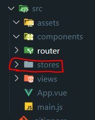

# Pinia 狀態管理庫 學習筆記

主要根據 Pinia 官方文檔整理的學習筆記，方便查閱。

## 官方文檔

> https://pinia.vuejs.org <br> https://pinia.vuejs.org/zh

## 目錄

- [簡介](#簡介)

- [安裝 Pinia](#安裝-pinia)

- [基礎配置](#基礎配置)

- [Store 介紹](#store-介紹)

  - [使用時機](#使用時機)

  - [定義 Store](#定義-store)

  - [使用 Store](#使用-store)

  - [從 Store 解構](#從-store-解構)

## 簡介

Pinia 為 Vue 的專屬狀態管理庫，**允許跨組件或頁面共享狀態**，並且支持 Vue 2 和 Vue 3。

以下筆記使用 Vue 3 搭配 Vue Router 4 來說明，Vue 2 相關部分請參考[官方文檔](#官方文檔)。

補充筆記：

- [Vue 3 學習筆記](https://github.com/YPINPIN/vue3-note?tab=readme-ov-file#vue-3-%E5%AD%B8%E7%BF%92%E7%AD%86%E8%A8%98)

- [Vue Router 4 學習筆記](https://github.com/YPINPIN/vue-router4-note?tab=readme-ov-file#vue-router-4-%E5%AD%B8%E7%BF%92%E7%AD%86%E8%A8%98)

## 安裝 Pinia

### 1. 基於 Vite 創建新專案

在環境安裝時選擇添加使用 Pinia 即可。

```bash
npm create vue@latest
```


Pinia 相關文件夾：


### 2. 現有專案新增安裝

安裝完成後需要自己配置相關文件，參考下面的[基礎配置](#基礎配置)。

```bash
npm install pinia
```


## 基礎配置

### 1. main.js 創建 pinia 實例並使用

```javascript
import { createApp } from 'vue';
import App from './App.vue';
import router from './router';

// 創建 pinia 實例
import { createPinia } from 'pinia';
const pinia = createPinia();

const app = createApp(App);

app.use(router);
// 使用 pinia
app.use(pinia);

app.mount('#app');
```

### 2. 新增 Pinia 相關文件夾 stores

在 src 下建立 stores 資料夾，通常定義的 Store 文件會放置在此。



## Store 介紹

**Store 是一個保存狀態和邏輯的實體**，有點像一個永遠存在的組件，每個組件都可以讀取和寫入它。

它有三個概念：state、getters、actions，可以假設這些概念相當於組件中的 data、computed、methods。

### 使用時機

一個 Store 應該包含可以在整個應用中訪問的數據，像是需要在許多地方使用的數據 (使用者訊息、多步驟表單等等) ，而應該避免在 Store 中引入可以在組件中保存的本地數據。

### 定義 Store

在 stores 資料夾下新增一個 js 檔案，使用 `defineStore()` 定義 Store 並 export。

**第一個參數要求是一個獨一無二的名字**，這個名字也被用作 id，是必須傳入的，Pinia 將用它來連接 store 和 devtools。

`defineStore()` 的**第二個參數可以接受 Setup 函數或 Option 物件**，以下會分別介紹兩種類型。

> 習慣上通常會將 `defineStore()` 返回的函數以 `use` 為開頭命名。

- Option Store

  與 Vue 的選項式 API 類似，可以傳入一個帶有 `state`、`actions` 與 `getters` 屬性的 Option 物件。

  - state => store 的數據(data)

  - getters => store 的計算屬性(computed)

  - actions => store 的方法(methods)

  ```javascript
  // counter.js
  import { defineStore } from 'pinia';

  export const useCounterStore = defineStore('counter', {
    state: () => {
      return {
        count: 0,
      };
    },
    getters: {
      doubleCount: (state) => state.count * 2,
    },
    actions: {
      increment() {
        this.count++;
      },
    },
  });
  ```

- Setup Store

  與 Vue 的組合式 API 的 `setup` 函數相似，可以傳入一個函數，**該函數定義了一些響應式屬性和方法，並且返回一個帶有想暴露的屬性及方法的物件**。

  - ref() => state 屬性

  - computed() => getters

  - function() => actions

  ```javascript
  // counter2.js
  import { defineStore } from 'pinia';
  import { computed, ref } from 'vue';

  export const useCounter2Store = defineStore('counter2', () => {
    // 定義響應式屬性和方法，
    const count = ref(0);
    const doubleCount = computed(() => count.value * 2);
    function increment() {
      count.value++;
    }

    // 返回想暴露的屬性及方法的物件
    return {
      count,
      doubleCount,
      increment,
    };
  });
  ```

  > 需要注意：要讓 pinia 正確識別 state，必須在 setup store 中返回 state 的所有屬性，代表你不能在 store 中使用私有屬性。不完整返回會影響 SSR、開發工具和其他插件的正常運行。

### 使用 Store

在要使用 Store 的組件的 `<script setup>` 中引入並調用 `defineStore()` 返回的函數之後會創建 Store 實例，接著可以在組件中的任意位置訪問 Store 中的 `state`、`getters`、`actions` 中定義的任何屬性。

> 需要注意： Store 是一個用 `reactive` 包裝的物件，因此不需要使用 `.value`，**並且不能直接對它進行解構 (會破壞響應性)**，需要解構請參考以下的[從 Store 解構](#從-store-解構)。

Home.vue：

```vue
<script setup>
// 引入 Store
import { useCounterStore } from '@/stores/counter';

// 調用函數，現在可以在組件中使用 store
const store = useCounterStore();

// 可以直接調用 actions
setTimeout(() => {
  store.increment();
}, 1000);
</script>

<template>
  <h2>Home page</h2>
  <p>Count: {{ store.count }}</p>
  <p>doubleCount: {{ store.doubleCount }}</p>
  <div>
    <button @click="store.increment()">add count</button>
  </div>
</template>
```


### 從 Store 解構

**為了在解構時保持屬性的響應性，則需要使用 `storeToRefs()`**，它會為每一個響應式屬性創建 `ref` 引用，並且會跳過所有的 actions 或非響應式的屬性。

About.vue：

```vue
<script setup>
// 引入 Store
import { useCounterStore } from '@/stores/counter';
import { storeToRefs } from 'pinia';

// 調用函數，現在可以在組件中使用 store
const store = useCounterStore();

// 使用 storeToRefs 解構
const { count, doubleCount } = storeToRefs(store);
// 作為 actions 的 increment 可以直接解構
const { increment } = store;
</script>

<template>
  <h2>About page</h2>
  <p>Count: {{ count }}</p>
  <p>doubleCount: {{ doubleCount }}</p>
  <div>
    <button @click="increment()">add count</button>
  </div>
</template>
```


